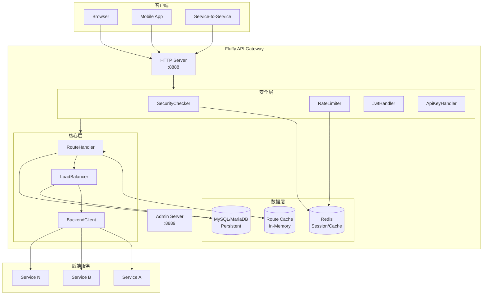

# Fluffy API Gateway

Fluffy 取自Harry Potter中三头犬，是一个基于 Vert.x 5.0 的高性能 API 网关。

## 系统架构



## 技术栈

| 组件 | 技术 | 版本 |
|------|------|------|
| 核心框架 | Vert.x | 5.0.10 |
| 数据库 | MySQL/MariaDB | 8.x |
| 缓存 | Redis | 6.x |
| 数据库客户端 | vertx-mysql-client | 5.0.10 |
| 缓存客户端 | vertx-redis-client | 5.0.10 |
| 构建工具 | Maven | 3.x |
| Java | OpenJDK | 11 |

## 核心模块

| 模块 | 说明 | 文档 |
|------|------|------|
| [路由模块](docs/modules/route.md) | 动态路由匹配与缓存 | [详情](docs/modules/route.md) |
| [负载均衡](docs/modules/loadbalancer.md) | 多策略负载均衡 | [详情](docs/modules/loadbalancer.md) |
| [安全认证](docs/modules/security.md) | JWT/API Key 认证 | [详情](docs/modules/security.md) |
| [黑白名单](docs/modules/blacklist-whitelist.md) | 访问控制 | [详情](docs/modules/blacklist-whitelist.md) |
| [限流器](docs/modules/ratelimiter.md) | Redis 滑动窗口限流 | [详情](docs/modules/ratelimiter.md) |
| [断路器](docs/modules/circuitbreaker.md) | 服务熔断保护 | [详情](docs/modules/circuitbreaker.md) |
| [配置管理](docs/modules/config.md) | 配置加载与管理 | [详情](docs/modules/config.md) |

## 功能列表

- [x] 路由管理 - 基于路径、方法的动态路由匹配
- [x] 负载均衡 - 支持轮询、随机、加权、一致性哈希
- [x] 安全认证 - JWT、API Key 认证
- [x] 黑白名单 - IP、用户、API Key 维度访问控制
- [x] 限流 - 基于 Redis 的滑动窗口限流
- [x] 断路器 - 服务熔断保护
- [x] 日志监控 - 异步访问日志写入数据库
- [ ] 聚合 - 多个服务响应聚合
- [ ] 金丝雀发布 - 灰度流量控制

## 快速开始

### 前置条件

- JDK 11+
- Maven 3.6+
- MySQL 8.0+
- Redis 6.x+

### 配置

创建 `src/main/resources/application.conf` 配置文件（JSON 格式）：

```json
{
  "db": {
    "host": "localhost",
    "port": 3306,
    "database": "fluffy",
    "username": "root",
    "password": "your_password",
    "maxPoolSize": 10,
    "connectionTimeout": 30000
  },
  "redis": {
    "host": "localhost",
    "port": 6379,
    "maxPoolSize": 10,
    "timeout": 5000
  },
  "app": {
    "port": 8888,
    "adminPort": 8889
  },
  "gateway": {
    "requestTimeout": 30000,
    "maxConcurrentRequests": 10000
  }
}
```

### 构建

```bash
# 运行测试
./mvnw clean test

# 打包
./mvnw clean package

# 运行应用
./mvnw clean compile exec:java
```

## License

MIT
