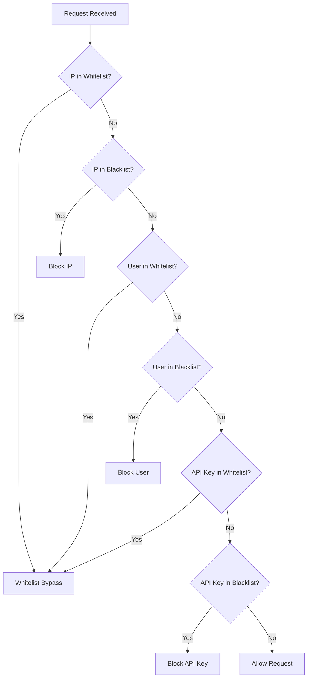

# 黑白名单模块

## 概述

`SecurityChecker` 提供基于 IP、用户、API Key 的访问控制。

## 安全检查流程



## 检查维度

| 目标类型 | 枚举值 | 说明 |
|----------|--------|------|
| IP 地址 | `IP` | 客户端 IP |
| 用户 ID | `USER` | 登录用户 |
| API Key | `API_KEY` | API Key ID |

## 核心接口

```java
public class SecurityChecker {

    /**
     * 检查是否在黑名单中
     */
    public Future<Boolean> isBlacklisted(TargetType type, String value);

    /**
     * 检查是否在白名单中
     */
    public Future<Boolean> isWhitelisted(TargetType type, String value);

    /**
     * 综合访问检查
     */
    public Future<SecurityCheckResult> checkAccess(String clientIp, Long userId, String apiKeyId);
}
```

## 检查结果

```java
public enum SecurityCheckResult {
    ALLOWED,    // 允许访问
    BLOCKED,    // 拒绝访问
    BYPASSED    // 白名单跳过
}
```

## 缓存机制

- 结果缓存到 Redis，TTL 60 秒
- 缓存 Key 格式: `security:{bl|wl}:{type}:{value}`

## 数据模型

### Blacklist

| 字段 | 类型 | 说明 |
|------|------|------|
| id | Long | 主键 |
| targetType | String | 目标类型 (IP/USER/API_KEY) |
| targetValue | String | 目标值 |
| reason | String | 封禁原因 |
| expiresAt | DateTime | 过期时间（可选） |

### Whitelist

| 字段 | 类型 | 说明 |
|------|------|------|
| id | Long | 主键 |
| targetType | String | 目标类型 |
| targetValue | String | 目标值 |
| reason | String | 添加原因 |
| expiresAt | DateTime | 过期时间（可选） |

## 源码

- `src/main/java/com/halfhex/fluffy/security/SecurityChecker.java`
- `src/main/java/com/halfhex/fluffy/entity/Blacklist.java`
- `src/main/java/com/halfhex/fluffy/entity/Whitelist.java`
