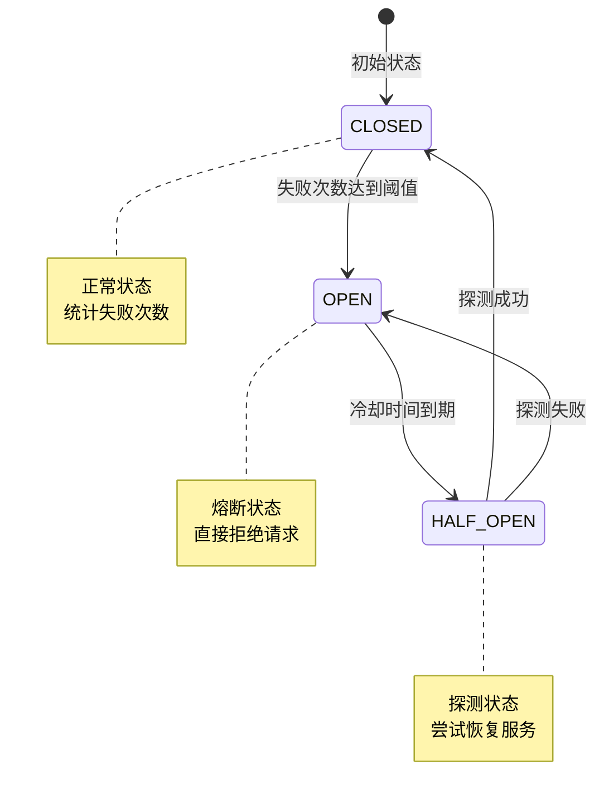

# 断路器模块

## 概述

`CircuitBreakerRepository` 管理服务断路器状态，实现服务熔断保护。

## 状态机



## 状态说明

| 状态 | 说明 | 行为 |
|------|------|------|
| CLOSED | 关闭 | 正常请求，统计失败 |
| OPEN | 打开 | 拒绝所有请求 |
| HALF_OPEN | 半开 | 允许探测请求 |

## 核心接口

```java
public class CircuitBreakerRepository {

    /**
     * 获取服务断路器状态
     */
    public Future<CircuitBreakerState> getState(Long serviceId);

    /**
     * 记录成功
     */
    public Future<Void> recordSuccess(Long serviceId);

    /**
     * 记录失败
     */
    public Future<Void> recordFailure(Long serviceId);

    /**
     * 检查是否允许请求
     */
    public Future<Boolean> allowRequest(Long serviceId);

    /**
     * 状态转换
     */
    public Future<Void> transitionState(Long serviceId, CircuitBreakerState.Status newState);
}
```

## 配置参数

| 参数 | 说明 | 默认值 |
|------|------|--------|
| failureThreshold | 打开断路器的失败次数 | 5 |
| successThreshold | 关闭断路器的成功次数 | 3 |
| openDuration | 断路器打开持续时间 | 60秒 |

## 数据模型

| 字段 | 类型 | 说明 |
|------|------|------|
| id | Long | 主键 |
| serviceId | Long | 服务 ID |
| state | String | 当前状态 |
| failureCount | Integer | 连续失败次数 |
| successCount | Integer | 连续成功次数 |
| lastFailure | DateTime | 最后失败时间 |
| stateChanged | DateTime | 状态变更时间 |

## 源码

- `src/main/java/com/halfhex/fluffy/repository/CircuitBreakerRepository.java`
- `src/main/java/com/halfhex/fluffy/entity/CircuitBreakerState.java`
