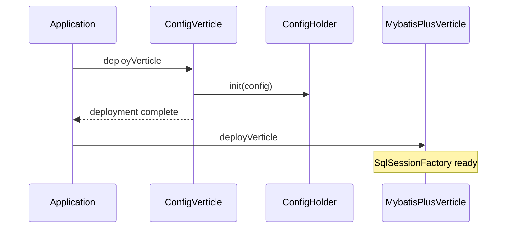

# 配置管理模块

## 概述

配置管理采用单例模式，通过 `ConfigHolder` 统一管理配置。

## 配置结构

```json
{
  "db": {
    "host": "localhost",
    "port": 3306,
    "database": "fluffy",
    "username": "root",
    "password": "",
    "maxPoolSize": 10,
    "connectionTimeout": 30000
  },
  "redis": {
    "host": "localhost",
    "port": 6379,
    "maxPoolSize": 10,
    "timeout": 5000
  },
  "app": {
    "port": 8888,
    "adminPort": 8889
  },
  "gateway": {
    "requestTimeout": 30000,
    "maxConcurrentRequests": 10000
  }
}
```

## 核心类

```java
public class ConfigHolder {

    private static ConfigHolder instance;

    private ConfigHolder(JsonObject config) {
        this.config = config;
    }

    public static void init(JsonObject config) {
        instance = new ConfigHolder(config);
    }

    public static ConfigHolder getInstance() {
        return instance;
    }

    // 数据库配置
    public String getDbHost();
    public int getDbPort();
    public String getDatabaseUrl();

    // Redis 配置
    public String getRedisHost();
    public int getRedisPort();

    // 应用配置
    public int getAppPort();
    public int getAppAdminPort();

    // 网关配置
    public long getGatewayRequestTimeout();
}
```

## Verticle 初始化顺序



## 数据源配置

使用 HikariCP 连接池：

```java
public class HikariCPConfig {

    public static DataSource createDataSource(ConfigHolder config) {
        HikariConfig HikariConfig = new HikariConfig();
        HikariConfig.setJdbcUrl(config.getDatabaseUrl());
        HikariConfig.setUsername(config.getDatabaseUsername());
        HikariConfig.setPassword(config.getDatabasePassword());
        HikariConfig.setMaximumPoolSize(config.getDbMaxPoolSize());
        HikariConfig.setConnectionTimeout(config.getDbConnectionTimeout());
        return new HikariDataSource(hikariConfig);
    }
}
```

## MyBatis-Plus 配置

```java
public class MybatisPlusConfig {

    public static SqlSessionFactory createSqlSessionFactory(DataSource dataSource) {
        MybatisSqlSessionFactoryBuilder builder = new MybatisSqlSessionFactoryBuilder();
        return builder.build(builder.build(new Resources().getResourceAsStream("mybatis-config.xml")));
    }
}
```

## 源码

- `src/main/java/com/halfhex/fluffy/config/ConfigHolder.java`
- `src/main/java/com/halfhex/fluffy/config/ConfigVerticle.java`
- `src/main/java/com/halfhex/fluffy/config/HikariCPConfig.java`
- `src/main/java/com/halfhex/fluffy/config/MybatisPlusConfig.java`
