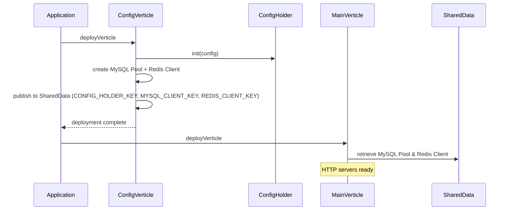

# 配置管理模块

## 概述

配置管理采用单例模式，通过 `ConfigHolder` 统一管理配置。数据库连接使用 Vert.x 响应式 MySQL 客户端（`vertx-mysql-client`），Redis 使用 `vertx-redis-client`。

## 配置结构

```json
{
  "db": {
    "host": "localhost",
    "port": 3306,
    "database": "fluffy",
    "username": "root",
    "password": "",
    "maxPoolSize": 20,
    "connectionTimeout": 30000
  },
  "redis": {
    "host": "localhost",
    "port": 6379,
    "maxPoolSize": 10,
    "timeout": 5000
  },
  "app": {
    "port": 8888,
    "adminPort": 8889
  },
  "gateway": {
    "requestTimeout": 30000,
    "maxConcurrentRequests": 10000
  }
}
```

## 核心类

```java
public class ConfigHolder {

    private static volatile ConfigHolder instance;

    private ConfigHolder(JsonObject config) {
        this.config = config;
    }

    public static synchronized void init(JsonObject config) {
        instance = new ConfigHolder(config);
    }

    public static ConfigHolder getInstance() {
        return instance;
    }

    // 数据库配置
    public String getDbHost();
    public int getDbPort();
    public String getDatabaseUrl();

    // Redis 配置
    public String getRedisHost();
    public int getRedisPort();

    // 应用配置
    public int getAppPort();
    public int getAppAdminPort();

    // 网关配置
    public long getGatewayRequestTimeout();
}
```

`ConfigHolder` 使用 **volatile + synchronized** 双重检查模式实现线程安全的懒加载。

## Verticle 初始化顺序



## 数据源配置

使用 Vert.x 响应式 MySQL 客户端：

```java
MySQLConnectOptions connectOptions = new MySQLConnectOptions()
    .setPort(config.getDbPort())
    .setHost(config.getDbHost())
    .setDatabase(config.getDbDatabase())
    .setUser(config.getDbUsername())
    .setPassword(config.getDbPassword());

PoolOptions poolOptions = new PoolOptions()
    .setMaxSize(config.getDbMaxPoolSize());

Pool pool = MySQLPool.pool(vertx, connectOptions, poolOptions);
```

## 共享数据

`ConfigVerticle` 通过 Vert.x SharedData 发布以下资源：

| Key | 类型 | 说明 |
|-----|------|------|
| `CONFIG_HOLDER_KEY` | `ConfigHolder` | 配置单例 |
| `MYSQL_CLIENT_KEY` | `Pool` | MySQL 连接池 |
| `REDIS_CLIENT_KEY` | `Redis` | Redis 客户端 |

## 源码

- `src/main/java/com/halfhex/fluffy/config/ConfigHolder.java`
- `src/main/java/com/halfhex/fluffy/config/ConfigVerticle.java`
