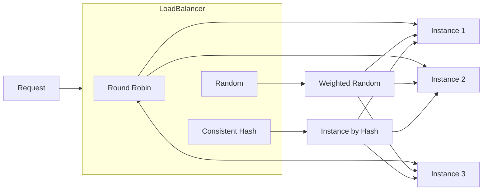

# 负载均衡模块

## 概述

`LoadBalancer` 负责从多个服务实例中选择一个来处理请求。

## 支持的策略

| 策略 | 常量 | 说明 |
|------|------|------|
| 轮询 | `ROUND_ROBIN` | 依次循环选择实例 |
| 随机 | `RANDOM` | 根据权重随机选择 |
| 一致性哈希 | `CONSISTENT_HASH` | 基于哈希的会话保持 |



## 核心接口

```java
public class LoadBalancer {

    /**
     * 使用指定策略选择实例
     */
    public Future<Instance> selectInstance(Long serviceId, String strategyType);

    /**
     * 使用默认策略（轮询）选择实例
     */
    public Future<Instance> selectInstance(Long serviceId);

    /**
     * 记录成功请求
     */
    public void recordSuccess(Long instanceId);

    /**
     * 记录失败请求
     */
    public void recordFailure(Long instanceId);
}
```

## 算法细节

### 轮询 (Round Robin)

```java
private Instance selectRoundRobin(Long serviceId, List<Instance> instances) {
    AtomicInteger counter = roundRobinCounters.computeIfAbsent(serviceId, k -> new AtomicInteger(0));
    int index = Math.abs(counter.getAndIncrement()) % instances.size();
    return instances.get(index);
}
```

### 加权随机 (Weighted Random)

```java
private Instance selectRandom(List<Instance> instances) {
    int totalWeight = instances.stream().mapToInt(Instance::getWeight).sum();
    if (totalWeight <= 0) {
        return instances.get(random.nextInt(instances.size()));
    }

    int randomWeight = random.nextInt(totalWeight);
    int cumulativeWeight = 0;
    for (Instance instance : instances) {
        cumulativeWeight += instance.getWeight();
        if (randomWeight < cumulativeWeight) {
            return instance;
        }
    }
    return instances.get(0);
}
```

## 实例健康检查

只有 `healthy = true` 且 `enabled = true` 的实例才会被选择。

## 源码

- `src/main/java/com/halfhex/fluffy/gateway/LoadBalancer.java`
- `src/main/java/com/halfhex/fluffy/entity/ServiceInstance.java`
- `src/main/java/com/halfhex/fluffy/repository/ServiceInstanceRepository.java`
