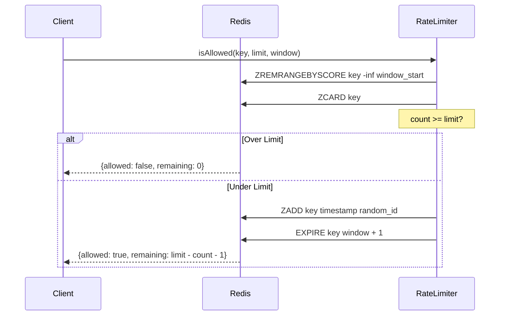

# 限流器模块

## 概述

`RateLimiter` 基于 Redis 实现滑动窗口算法的请求限流。

## 算法原理

滑动窗口算法使用 Redis Sorted Set 实现：



## Lua 脚本

```lua
local key = KEYS[1]
local limit = tonumber(ARGV[1])
local window = tonumber(ARGV[2])
local now = tonumber(ARGV[3])
local window_start = now - window

redis.call('ZREMRANGEBYSCORE', key, '-inf', window_start)
local count = redis.call('ZCARD', key)

if count >= limit then
    return {0, 0}
end

local time = redis.call('TIME')
local micro = time[1] * 1000000 + time[2]
redis.call('ZADD', key, now, micro)
redis.call('EXPIRE', key, window + 1)
return {1, limit - count - 1}
```

## 限流维度

| 类型 | 枚举值 | 说明 |
|------|--------|------|
| IP 限流 | `IP` | 按客户端 IP 限流 |
| 用户限流 | `USERNAME` | 按用户 ID 限流 |
| 全局限流 | `GLOBAL` | 全局限流 |

## 多层限流

支持分钟、小时、天三级限流：

```java
public Future<RateLimitResult> checkRateLimit(RateLimitType type, String identifier, RateLimitRule rule) {
    // 分钟级限流
    return isAllowed(key + ":minute", burstLimit, 60)
        .compose(minuteResult -> {
            if (!minuteResult.isAllowed()) return Future.succeededFuture(minuteResult);
            // 小时级限流
            return isAllowed(key + ":hour", rule.getRequestsPerHour(), 3600)
                .compose(hourResult -> {
                    if (!hourResult.isAllowed()) return Future.succeededFuture(hourResult);
                    // 天级限流
                    return isAllowed(key + ":day", rule.getRequestsPerDay(), 86400);
                });
        });
}
```

## 核心接口

```java
public class RateLimiter {

    /**
     * 单层限流检查
     */
    public Future<RateLimitResult> isAllowed(String key, int maxRequests, int windowSeconds);

    /**
     * 多层限流检查
     */
    public Future<RateLimitResult> checkRateLimit(RateLimitType type, String identifier, RateLimitRule rule);
}

public class RateLimitResult {
    private final boolean allowed;
    private final int remaining;

    public boolean isAllowed() { return allowed; }
    public int getRemaining() { return remaining; }
}
```

## 限流规则

| 字段 | 类型 | 说明 |
|------|------|------|
| ruleType | String | 规则类型 |
| identifier | String | 限流标识 |
| requestsPerMinute | Integer | 每分钟请求数 |
| requestsPerHour | Integer | 每小时请求数 |
| requestsPerDay | Integer | 每天请求数 |
| burstSize | Integer | 突发容量 |
| enabled | Boolean | 是否启用 |

## 源码

- `src/main/java/com/halfhex/fluffy/security/RateLimiter.java`
- `src/main/java/com/halfhex/fluffy/entity/RateLimitRule.java`
- `src/main/java/com/halfhex/fluffy/security/RateLimitType.java`
