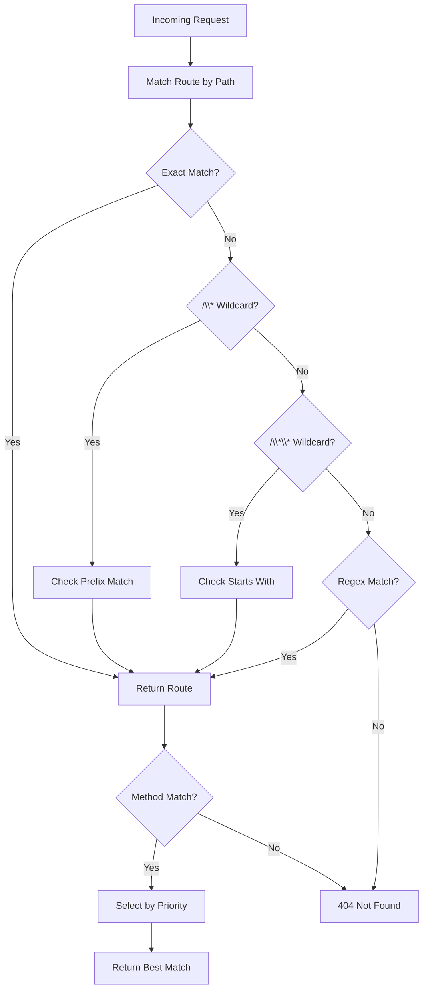

# 路由模块

## 概述

`RouteHandler` 负责管理和匹配 HTTP 请求路由。

## 路由匹配规则

| 模式类型 | 示例 | 匹配逻辑 |
|----------|------|----------|
| 精确匹配 | `/api/users` | 完全相等 |
| 单通配符 | `/api/*` | 前缀匹配 |
| 双通配符 | `/api/**` | 路径前缀匹配 |
| 正则 | `/api/users/*/orders` | 正则表达式 |

## 核心流程



## 核心接口

```java
public class RouteHandler {

    /**
     * 根据路径和方法匹配路由
     */
    public Future<GatewayRoute> matchRoute(String path, String method);

    /**
     * 刷新路由缓存
     */
    public Future<Void> refreshCache();

    /**
     * 启动定时缓存刷新（30秒）
     */
    public void startPeriodicRefresh();

    /**
     * 停止定时刷新
     */
    public void stopPeriodicRefresh();
}
```

## 数据模型

| 字段 | 类型 | 说明 |
|------|------|------|
| id | Long | 主键 |
| name | String | 路由名称 |
| pathPattern | String | 路径模式 |
| httpMethod | String | HTTP 方法 (GET/POST/PUT/DELETE...) |
| serviceId | Long | 目标服务 ID |
| authRequired | Boolean | 是否需要认证 |
| rateLimitEnabled | Boolean | 是否启用限流 |
| priority | Integer | 优先级（数值越大优先级越高） |
| deleted | Boolean | 逻辑删除 |

## 配置示例

```sql
-- 添加路由
INSERT INTO gateway_route (name, path_pattern, http_method, service_id, auth_required, rate_limit_enabled, priority)
VALUES ('User Service', '/api/users/**', 'GET', 1, true, true, 100);

-- 添加服务
INSERT INTO gateway_service (name, description, load_balance_strategy, enabled)
VALUES ('user-service', 'User Management Service', 'ROUND_ROBIN', true);

-- 添加实例
INSERT INTO service_instance (service_id, host, port, weight, healthy, enabled)
VALUES (1, 'localhost', 8080, 100, true, true);
```

## 缓存机制

- 路由信息缓存在内存中
- 默认每 30 秒自动刷新
- 支持手动调用 `refreshCache()` 刷新

## 源码

- `src/main/java/com/halfhex/fluffy/gateway/RouteHandler.java`
- `src/main/java/com/halfhex/fluffy/entity/GatewayRoute.java`
- `src/main/java/com/halfhex/fluffy/repository/RouteRepository.java`
