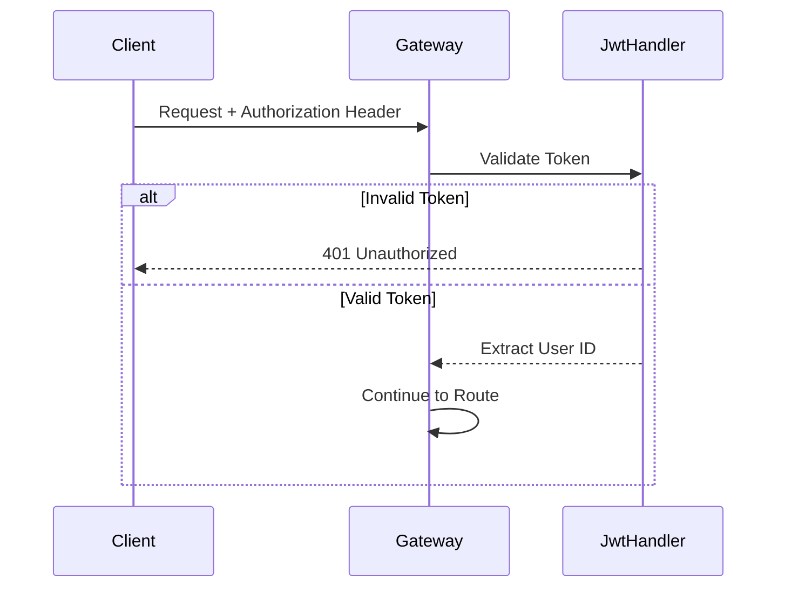
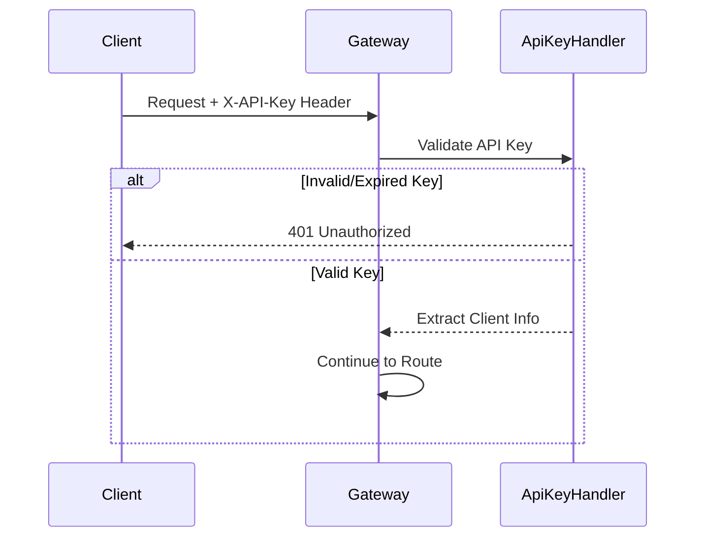

# 安全认证模块

## 概述

支持 JWT 和 API Key 两种认证方式。

## JWT 认证

### 配置

```java
public class JwtConfig {
    private String secret;           // JWT 密钥
    private long expiration;         // 过期时间（毫秒）
    private String issuer;           // 发行者
}
```

### 认证流程



## API Key 认证

### 认证流程



## 核心接口

```java
public class JwtHandler {

    /**
     * 验证 JWT Token
     */
    public Future<UserInfo> verifyToken(String token);

    /**
     * 生成 JWT Token
     */
    public String generateToken(UserInfo userInfo);
}

public class ApiKeyHandler {

    /**
     * 验证 API Key
     */
    public Future<ClientInfo> verifyApiKey(String apiKey);

    /**
     * 检查 Key 是否过期或被禁用
     */
    public Future<Boolean> isValid(String apiKeyId);
}
```

## 认证标记

路由配置中 `authRequired = true` 时启用认证。

## 源码

- `src/main/java/com/halfhex/fluffy/security/JwtHandler.java`
- `src/main/java/com/halfhex/fluffy/security/ApiKeyHandler.java`
- `src/main/java/com/halfhex/fluffy/security/JwtConfig.java`
